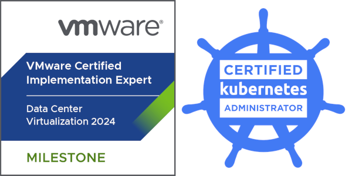

+++
title = "About me"
description = "Description about me"
date = "2025-01-08"
aliases = ["about-us", "about", "contact", "about-me", "about"]
author = "Peter Summa"
+++
Hey there! I’m **Peter Summa**, a Cloud Engineer at **evoila**, a tech-driven company based in Germany. 

With a strong focus on virtualization and cloud technologies, I specialize in solutions like **vSphere**, **NSX**, **Avi** and **Tanzu**. Over the years, I’ve worked hands-on with everything from traditional VMware environments to modern cloud-native technologies like **Terraform**, **Kubernetes**, and **VMware Cloud Foundation (VCF)**.

This blog is a place where I share my experiences, insights, and the lessons learned while building homelab setups, optimizing cloud environments, and deploying complex virtualized infrastructures. Whether you're looking to automate your workflows with **Terraform**, explore **Kubernetes** in a hybrid cloud setup, or dive into the intricacies of **VCF**, there’s something here for you.

When I’m not working on client projects or tinkering with my own homelab, I’m researching the latest trends in cloud engineering or finding ways to simplify complex technical problems. 

Thanks for stopping by! Feel free to reach out if you want to chat about virtualization, cloud engineering, or any of the technologies I’m passionate about. Let's connect and collaborate!

### **Certs**

[Credly](https://www.credly.com/users/peter-summa)

### Impressum
Die folgenden Angaben basieren auf den Vorgaben in § 5 DDG:

Peter Summa

Lindenstr. 2

74238 Krautheim

### Kontakt
mail: [petersumma96@gmail.com](mailto:petersumma96@gmail.com)

### Haftung für und Überprüfung von Inhalten:
Durch die Vorgaben in § 5 DDG bin ich als Webmaster für die Inhalte meines Blogs verantwortlich. Gleichzeitig befreien mich §§ 8 bis einschließlich § 10 TMG von der Verantwortung, übermittelte oder gespeicherte fremde Inhalte zu überwachen. Trotzdem bin ich mir meiner Pflicht bewusst, der Sperrung und Entfernung von Informationen nachzukommen, wie es geltende Gesetze vorgeben.

