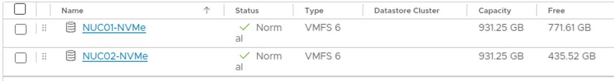
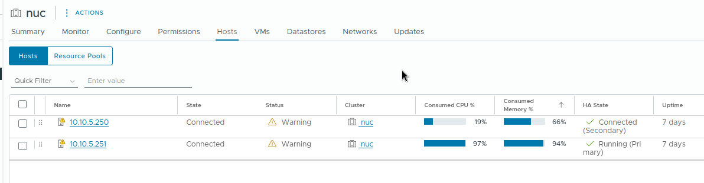
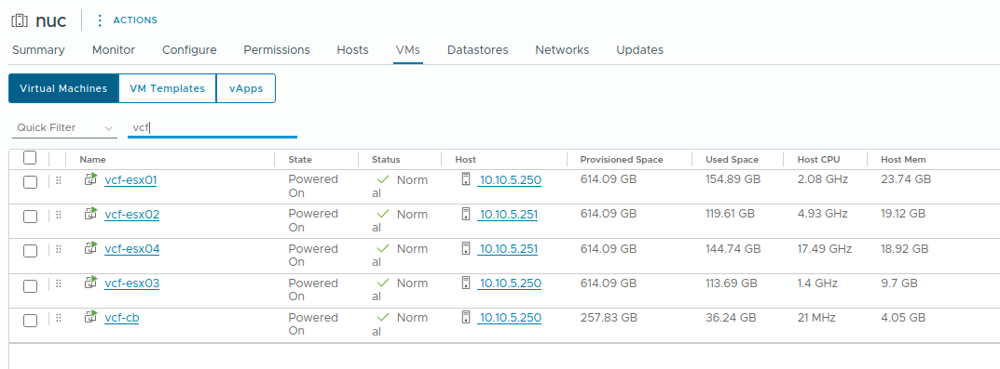

# Deploying VMware Cloud Foundation (VCF) on a Small Homelab – Is It Possible?  

Looking at the official requirements for VMware Cloud Foundation (VCF), they seem excessive for a small homelab setup. But is it still possible? Let's give it a try—the automated way!  

## Automating the VCF Deployment  

Deploying VCF manually is a time-consuming task. Preparing virtual ESXi hosts, configuring networking, and setting up storage can take hours. I wanted a more efficient solution—a script that could deploy VCF with just **one click**.  

That's when I came across [William Lam’s blog post](https://williamlam.com/2024/01/automated-lab-deployment-script-updated-to-support-vmware-cloud-foundation-vcf-5-1.html) about VCF deployment. His PowerShell script automates most of the setup, making the process much easier. However, there was one major limitation:  

- The script requires a **shared datastore** between the ESXi hosts, typically a vSAN datastore.  
- Since I only have **two Intel NUCs**, vSAN wasn't an option due to the missing third witness node.  
- I also don’t have the necessary storage for an **NFS or iSCSI share**.  

## Adapting the Script for My Setup  

To make this work, I had to modify the script to fit my environment. The first challenge was that the script requires several inputs, which wasn’t an issue—until it came to selecting a datastore. The script only allows specifying **one** datastore, which didn't work for my setup.

So lets see what changes needs to be done to get the script to work on our limited setup.

### Changes I Made  

To successfully deploy VCF on my **two-node cluster**, I modified the script in several ways:  

- **Reduced the NSX Manager size** to **small** to save resources.  
```pwsh {}
$NSXManagerSize = "small"
```
- **Lowered the nested ESXi CPU count** from **12 to 8** to fit within my available hardware.  
```pwsh {}
$NestedESXiMGMTvCPU = "8"
```
- **Modified the datastore variable** to match my **NUC-specific naming pattern**, allowing me to use individual NVMe disks.
```pwsh {}
$VMDatastorePattern = "*NVMe*" #pattern for local vmfs *NVMe* 
```


- **Removed workload domain input**, as deploying additional workload domains is impractical for my small homelab.  
- **Adjusted the deployment logic** for nested ESXi hosts:
  - I distributed the **four nested ESXi hosts** across my two NUCs.  
  - **Odd-numbered hosts** go on `esxi01`, while **even-numbered hosts** go on `esxi02`.  
  - This ensures an even distribution of nested ESXi hosts across the two-node cluster.

```pwsh {}
$counter = 0 #counter to track the deployments
   $NestedESXiHostnameToIPsForManagementDomain.GetEnumerator() | Sort-Object -Property Value | Foreach-Object {
       $VMName = $_.Key
       $VMIPAddress = $_.Value

       $evenorodd = $counter % 2 #check if counter is odd or even
       $vmhost = ($cluster | Get-VMhost | Sort-Object)[$evenorodd] #select esxi host 
       $datastore = ($vmhost | Get-Datastore -Name $VMDatastorePattern) #select datastore with the pattern
```

- Ensure **Cloudbuilder** is also deployed on a local Datastore
```pwsh {}
if($deployCloudBuilder -eq 1) {
    $vmhost = ($cluster | Get-VMhost | Sort-Object)[0]
    $datastore = ($vmhost | Get-Datastore -Name $VMDatastorePattern)
```

- Shutdown **vCenter** in order to save some extra resources ;)
```pwsh{}
My-Logger "Going to wait 240 seconds then turning off vcenter to safe resources..."
sleep 240

Connect-VIServer -server $VIServer -user $VIUsername -password $VIPassword 
Get-VM -Name vcsa | Stop-VMGuest -Confirm:$false

Disconnect-VIServer * -Confirm:$false 
```


For instruction how to run the script and adjust it you can have a look at the original github repo from william lam. 
https://github.com/lamw/vcf-automated-lab-deployment




As we can see both NUCs are heavy loaded with the nested ESXi Hosts, but all good to get a overview and first touchpoints with VCF.


## Cleanup Script for Easy Reset  

To make experimenting with VCF deployments easier, I also created a **cleanup script**. This script allows me to completely remove the VCF installation, clean up the environment, and restart vCenter—ready for a fresh deployment.  

The cleanup script performs the following tasks:  

- Connects to the **Intel NUCs**.  
- Stops and removes all **nested ESXi hosts**.  
- Start the powered off **vCenter**.
- Removes any leftover **vApp** from the vCenter inventory. 

```pwsh { title = "cleanup.ps1" }
$vcentervm = "vcsa"
$vcenterip = "10.10.5.10"
$vcenterpw = "VMware1!"
$esxis = @("10.10.5.250", "10.10.5.251")
$esxipassword = 'VMware1!'

foreach ($esxi in $esxis) {
    Connect-VIserver -server $esxi -user root -password $esxipassword 
    Get-VM -Name vcf-* | Stop-VM -Confirm:$false
    Get-VM -Name vcf-* | Remove-VM -DeletePermanently -Confirm:$false
    if (Get-VM -Name $vcentervm -ErrorAction SilentlyContinue) {
        Get-VM -Name $vcentervm | Start-VM
    }
    Disconnect-VIServer -server 10.10.5.250 -Confirm:$false 
}

while ($true) {
    try {
        Connect-VIserver -server $vcenterip -user administrator@vsphere.local -password $vcenterpw
        Get-VApp -Name 'Nested-VCF-*' | Remove-VApp -DeletePermanently -Confirm:$false -ErrorAction SilentlyContinue
        Disconnect-VIServer * -Confirm:$false 
        exit
    }
    catch {
        Write-Host "Sleep 1min and try to connect to vcenter"
        sleep 60
    }
}
```

## Conclusion  

By tweaking the script, I managed to work around the shared datastore requirement and adapt the deployment to my limited homelab resources. In an upcoming post, I'll dive deeper into the technical details of these modifications and share the full deployment process.  

Feel free to have a look at the script and try it in your homelab :) 

https://github.com/p3t35/vcf-automated-lab-deployment

Stay tuned! 🚀 