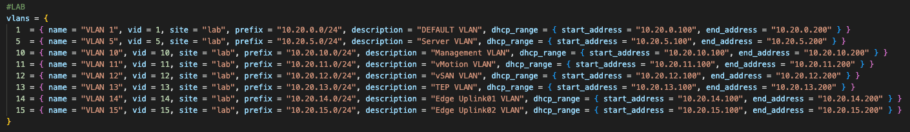
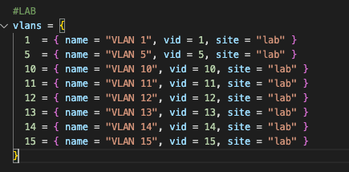
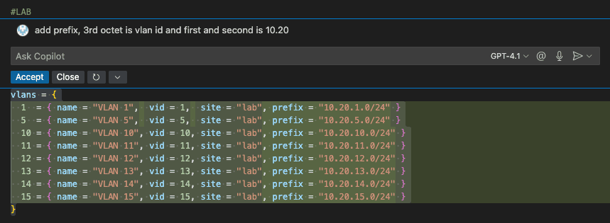
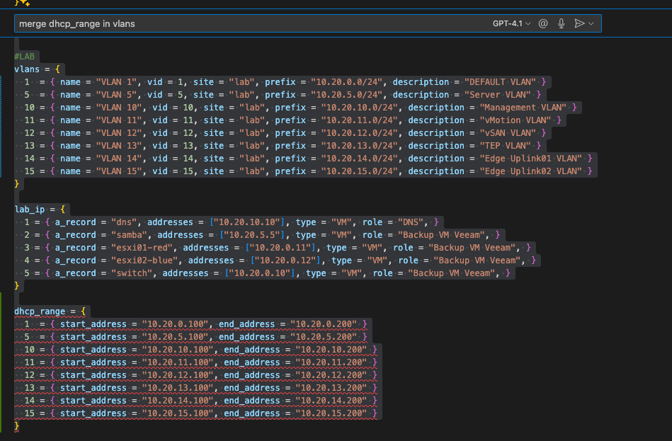

# Organizing my homelab with NetBox & Terraform

Another Sunday, another day to dive into the homelab!

While I'm waiting for an additional component to arrive (stay tuned for that!), I figured it's a good time to get a bit more organized. Over time, it’s become harder to track my devices, "racks" (okay, to be fair, I don’t really need racks **yet** – [see this old blog post](http://localhost:1313/post/vcf9-2-node-setup/)), and most importantly, all of my IP addresses and VLANs.

I’ve been wanting to explore **NetBox** for a while now, and this felt like the right moment to give it a proper test run.

---

## 🚀 Getting Started with NetBox

I'm running NetBox via Docker on a VM hosted on my Proxmox server.

To set it up, I used the official NetBox Docker guide:  
👉 [https://github.com/netbox-community/netbox-docker](https://github.com/netbox-community/netbox-docker)

The setup process went smooth and straightforward.

So lets dive into **Netbox**

But hey – clicking through a UI and manually setting things up? That’s not 2025. This is why I decided to manage **NetBox with Terraform**.

Bonus: I also added my **Windows DNS** and **private AdGuard server** to Terraform, so I can keep track of all my used IP addresses in one centralized, without adding DNS records manually.

---

## 🧰 Terraform Setup Overview

*(I won’t be covering basic Terraform usage – there are plenty of great tutorials out there.)*

### 🔧 File Structure

To keep things clean, I split my Terraform code into logical chunks:

- `provider.tf`: Defines providers and authentication
- `dcim.tf`: For **Data Center Infrastructure Management**
- `ipam.tf`: For **IP Address Management**
- `dns.tf`: For **DNS Management**

These files describe how and what resources terraform should create

Additionally, I’ve got:

- `variables.tf`: Declares all input variables
- `terraform.tfvars`: Stores my specific input values

I’ve tried to keep things **as simple as possible**.

This is my current provider configuration 

**provider.tf**

```terraform{}
terraform {
  required_providers {
    netbox = {
      source  = "e-breuninger/netbox"
      version = "4.1.0"
    }
    dns = {
      source  = "hashicorp/dns"
      version = "~> 3.0"
    }
    adguard = {
      source  = "gmichels/adguard"
      version = "1.6.2"
    }
  }
}

# example provider configuration for https://demo.netbox.dev
provider "netbox" {
  server_url         = "http://192.168.169.2:8000"
  api_token          = "insertapitokenhere"
  skip_version_check = true
}

# Configure the DNS Provider
provider "dns" {
  update {
    server = "10.20.10.10"
  }
}

provider "adguard" {
  host     = "192.168.169.53:80"
  username = "admin"
  password = var.adguard_password
  scheme   = "http" # defaults to https
  timeout  = 5      # in seconds, defaults to 10
  insecure = true   # when `true` will skip TLS validation
}
```

---

## 🗂️ Organizing Infrastructure with Variables

I split my input variables (`terraform.tfvars`) into three main sections:

1. **Physical Infrastructure**  red
   - Racks, sites, and devices  

2. **Home Network**  orange
   - Network configuration and device mappings

3. **Lab Environment**  green
   - VLANs, test devices, lab-specific segments

These input variables map directly to Terraform resources.


---

## 🔄 Example: Managing VLANs

Here’s a quick look at how I manage VLANs using Terraform. I will not cover every section of my terraform, you can look at the full code at my github 
https://github.com/p3t35/homelab-terraform

Each VLAN is defined in a variable as part of an array. Every item in that array contains the full dataset needed for NetBox.

So if I want to add a new VLAN? I simply copy a row in the array and tweak the values. Terraform takes care of the rest. 🙌



And here’s how that variable gets mapped to a resource:


As you can see, the information from each dataset is dynamically pulled into different resources. No need to touch each resource block when I want to create or update VLANs. This makes it easy and smooth to add additional information.
With the help of for_each loops in terraform you can handle this datasets very clean.

This is what the result from the terraform code looks like: 


---

Whit this method I also managed my Windows DNS entries and my home adguard dns rewrites. 
This is also a good example of using different provider and resource types for creating dns entries from one variable file.


I hope this gives a clearer idea of how I’m using NetBox and Terraform to automate and organize my homelab. There’s still a lot to do, but this is a solid foundation to build on.

In the end, I built a Terraform-based setup that might be a bit overengineered — but it keeps everything organized and in one place. I'm sure this codebase will continue to evolve over time, with new providers and systems added along the way. 

This should give you a quick introduction and idea how to manage stuff with terraform, depending on your needs and environment this could be expanded with other resources. For example you could managed your firewall rules or virtual machines with terraform. For nearly everything there is an terraform provider out there - so give it a try ;) 

In more andanved setups you can combine terraform with CI/CD workflows to automate this hole process further. 
May I will cover this in another blog post.
So stay tuned! 😊

---

Last but not least, a quick shoutout to Visual Studio Code and its GitHub Copilot feature. It’s made writing code so much easier and was a huge help throughout this project.

Here are three examples of how I used Copilot to write Terraform code:

In the first example I needed to add prefixes to each VLAN, so I explained my need very quick.



In the second example I wanted to combine two variables which went pretty easy



More updates soon!