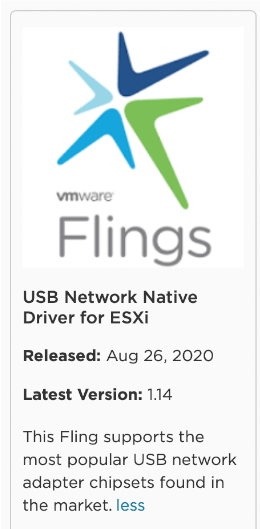

# Opensense
To maintain a clear separation between my homelab and home network, I needed a firewall. A physical firewall wasn’t an option since I wanted to keep the lab compact. This left me with the choice of a virtual firewall. After researching, I narrowed down the options to three main solutions: pfSense, OPNsense, and VyOS.

Previously, I had experience using pfSense for virtual firewalling. For my homelab, I decided to try OPNsense to gain familiarity with it. While VyOS is also on my radar for the future, my immediate focus was on getting OPNsense up and running.

This article focuses on configuring OPNsense for a homelab setup. I won’t delve into the detailed installation process, as many other blogs already cover that topic.

Here’s an overview of my network configuration:

The OPNsense virtual machine (VM) has an "external" IP address connected to the home network. On the LAN side, it uses multiple VLAN interfaces. This setup enables the creation of distinct networks, allowing me to simulate a "real-world" environment. It’s particularly useful for mirroring customer environments with various VLANs.

All external traffic is NATed through the external IP address to access the internet and other resources. For management and access, I rely on a Linux jump host with xrdp installed. On the OPNsense side, I configured DNAT rules to forward traffic for RDP (port 3389) and SSH (port 22) from the external IP to the internal IP of the jump host. This approach ensures I can access the lab from any device.

To configure the "LAN" interface on OPNsense, I created a port group that trunks all VLANs, as shown in the screenshot below:
 

# ESXi Networking
Next, let’s look at the networking setup for the two ESXi hosts in the lab. 

Both hosts utilize vSwitch0, which connects the ESXi hosts and the OPNsense VM to the home network. For internal homelab traffic, I created a Distributed Switch. This switch includes the trunk port group for OPNsense and VLAN-tagged port groups for services like vCenter, NSX Manager, and other VMs.

Using a Distributed Switch is essential for enabling MAC learning, a feature not available on standard vSwitches. MAC learning is particularly useful when running nested ESXi hosts. For more details on this topic, check out the blog post by my colleague Daniel Krieger, which highlights the advantages of MAC learning over promiscuous mode:

[MAC Learning is your friend](https://sdn-warrior.org/posts/mac-learning/)

The internal Distributed Switch uses a direct connection between the two ESXi hosts, providing a 2.5 Gbps connection for all internal traffic, VM traffic, and vMotion. Additionally, the ESXi hosts have a vmkernel interface (vmk1) on this Distributed Switch.

# ESXi USB NIC Driver
If you’ve examined the [setup](https://ps-cloudlabs.com/setup/) closely, you might have noticed a USB NIC attached to one of the ESXi hosts. This is because one NUC has 2 x 2.5 Gbps ports, while the other has 1 x 2.5 Gbps port plus an attached 1 Gbps USB NIC.

To enable the USB NIC, I installed the USB Network Native Driver for ESXi, a community-provided fling.

You can find more details about the USB Network Native Driver for ESXi here:

https://community.broadcom.com/flings/home