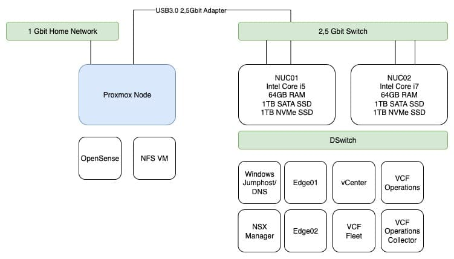
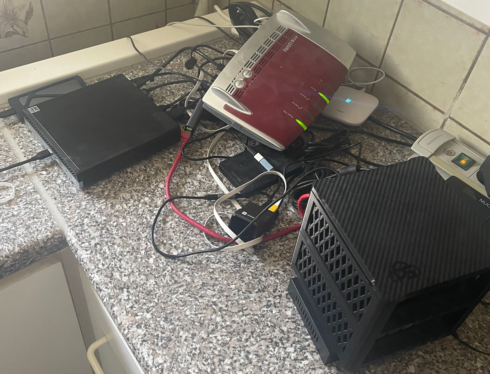

# VCF 9 Is Around the Corner – Time to Upgrade the Homelab

With **VCF 9** right around the corner, it’s the perfect moment to give the homelab a long overdue upgrade.

---

## New Hardware: 8-Port 2.5Gbit Switch

To kick things off, I picked up an **8-port 2.5 Gbit switch** from AliExpress for just **€54**. Surprisingly, it performs well for its price and fits nicely into the homelab setup - the webui is a little "oldschool" but those its job. It’s a great value option for those looking to upgrade their networking without spending a fortune. 

---

## Goodbye Nested Hosts and hello Traditional NFS

Thanks to the **reduced requirements** and improved **flexibility** of VCF 9, I’ve decided to **deploy VCF 9 without nested ESXi hosts**.

I’m currently missing a third NUC or a dedicated storage host, so I opted for a improvised storage solution for providing NFS storage to my lab.

---

## Proxmox + USB NIC + Ubuntu VM = DIY NFS

I had a **2.5 Gbit USB 3.0 adapter** lying around, which I connected to my **always-on Proxmox node**. On this node, an **Ubuntu VM** runs with a **single NVMe drive** acting as the shared storage.

At first, I wasn’t sure if this setup would even work—but hey, why not give it a try?

Additionally, I **migrated my pfSense** firewall to this Proxmox node as well, isolating firewall responsibilities from my lab hosts.

And this is what the current state looks like: 

---

## ESXi with NVMe Tiering

For the ESXi nodes, I went with **NVMe tiering**, which is now a **fully supported feature** in ESXi 9. Setup was straightforward, and everything installed smoothly.

---

## VCF 9 Installation Experience

The **new VCF 9 installation UI** is a major improvement. It’s **much easier and more flexible**, especially for “special” configurations that previously required manually tweaking JSON files (looking at you, VCF 5.2).

Deployment went better than expected:

- **Edge node deployment** worked on my limited setup  
- Storage latency is not ideal but works 
- The **Windows jump host** feels a bit laggy  

…but for testing and getting hands-on experience with VCF 9, it’s **surprisingly good**.

---

## Looking Ahead

There’s definitely room for **future improvements**, particularly in the **storage department**, but I have to say—**VCF 9 is a big leap forward** for the VCF platform overall.

---

## Final Thoughts

That’s the current state of my lab. I mainly wanted to **showcase what’s possible with limited hardware** and encourage others to tinker, test, and **see what you can achieve** with some creativity and the right tools.

Until next time—keep homelabbing!

Last but not least, a real-world picture of what an improvised homelab looks like: "the more you look, the worse it gets".

