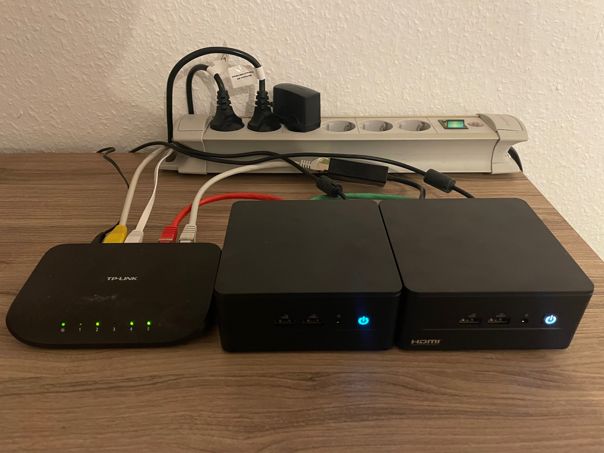
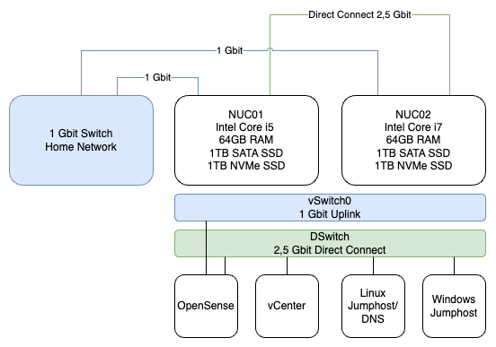

## Hardware

## Network

## BOM (Bill of Material)

| Component               | Specifications                                         |
|-------------------------|--------------------------------------------------------|
| Intel NUC i5             | 2 x 32GB RAM, 1TB SATA SSD, 1TB NVMe SSD               |
| Intel NUC i7             | 2 x 32GB RAM, 1TB SATA SSD, 1TB NVMe SSD               |
| TP-Link Switch           | 5 Port, 1 Gbit Ethernet                               |