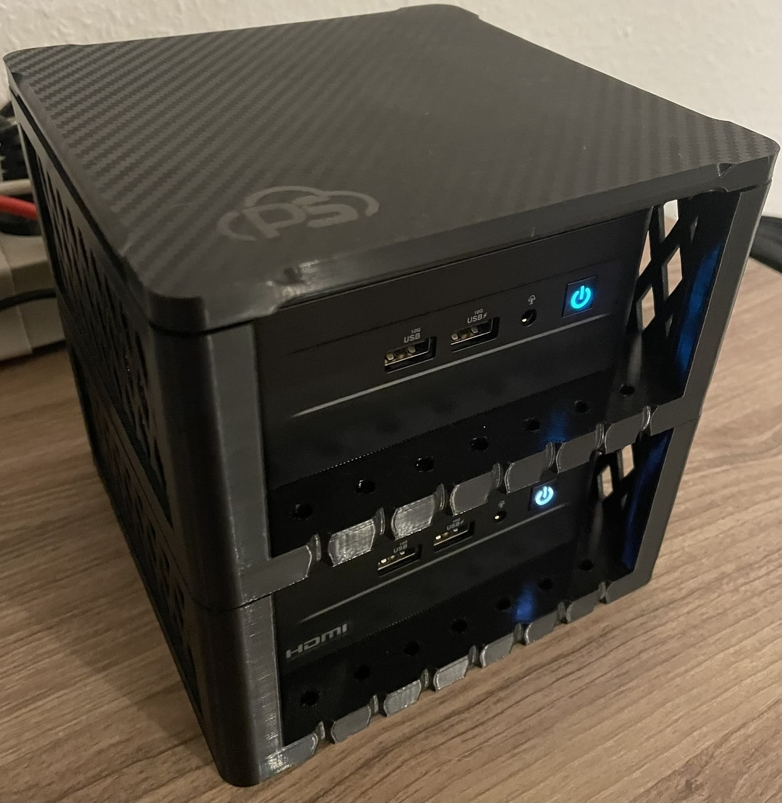
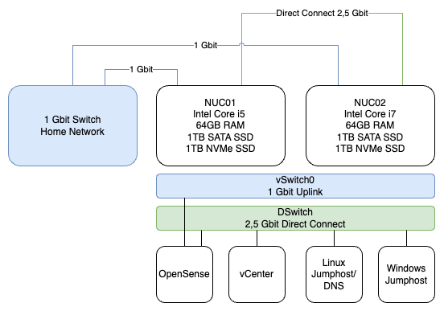

## Hardware
**11.03.2025 - Little Upgrade**

Thanks to my colleague Timur for the 3D printed surprise :)

## Network

## BOM (Bill of Material)

| Component               | Specifications                                         |
|-------------------------|--------------------------------------------------------|
| Intel NUC13 i5             | 2 x 32GB RAM, 1TB SATA SSD, 1TB NVMe SSD               |
| Intel NUC13 i7             | 2 x 32GB RAM, 1TB SATA SSD, 1TB NVMe SSD               |
| HORACO 2,5 GbE Managed Switch 8 Port           | 8 Port, 2,5 Gbit Ethernet                               |